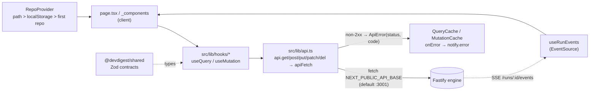

# UI architecture — `client` (`@devdigest/web`)

How the Next.js 15 app is put together and how data reaches the screen.
Paths are relative to `client/`. Behavioural contracts live in
[`../specs/pages.md`](../specs/pages.md).

## 1. Route tree (App Router)

```
src/app/
  layout.tsx                          Server — html shell, i18n + Providers
  globals.css                         imports ../vendor/ui/styles.css
  page.tsx                            /                      client — redirect to first repo
  onboarding/page.tsx                 /onboarding            client — AddRepoView
  agents/page.tsx                     /agents                server (thin) → AgentsListView
  agents/[id]/page.tsx                /agents/:id            client — list rail + AgentEditor
  repos/[repoId]/pulls/page.tsx       /repos/:repoId/pulls   client — PR list
  repos/[repoId]/pulls/[number]/page.tsx  .../pulls/:number  client — PR detail
  settings/[section]/page.tsx         /settings/:section     server (thin) → SettingsView
```

There are no nested `layout.tsx`, `loading.tsx`, `error.tsx` or route handlers.
Every page renders its own chrome by wrapping content in `AppShell`
(`src/components/app-shell/AppShell.tsx`); `/onboarding` is the only full-bleed
page without it. Route-private code sits in `_components/` folders (the
underscore keeps them out of routing).

## 2. Server vs Client boundary

The app is effectively a client-rendered SPA inside a server shell.

- **Server Components (no `"use client"`):** `src/app/layout.tsx`,
  `src/app/agents/page.tsx`, `src/app/settings/[section]/page.tsx`. They do no
  data fetching; the layout only resolves locale/messages
  (`getLocale`/`getMessages`) and mounts `NextIntlClientProvider` + `Providers`.
- **Client Components:** everything else that renders — the other four
  `page.tsx` files, every file under `_components/`, all of `src/components/*`,
  all hook files in `src/lib/hooks/*`, and `src/lib/providers.tsx`,
  `repo-context.tsx`, `theme.tsx`, `toast.tsx`.
- `src/lib/api.ts`, `cost.ts`, `github-urls.ts`, `model-label.ts`,
  `feature-models.ts`, `types.ts` are plain isomorphic modules.
- `<Providers>` is wrapped in `<Suspense fallback={null}>` in the layout because
  pages call `useSearchParams()`.

Provider order (`src/lib/providers.tsx`):
`QueryClientProvider → ThemeProvider → ToastProvider → RepoProvider`.

## 3. Data layer



- **`src/lib/api.ts`** — the only place that calls `fetch`. Errors are
  normalised to `ApiError { status, code, details }`; a network failure is
  `status 0 / code "network_error"`. `content-type: application/json` is set
  only when a body is sent (Fastify rejects an empty JSON body). `204` returns
  `undefined`.
- **`src/lib/hooks/`** — one file per domain, all re-exported from `index.ts`:
  `core.ts` (settings, secrets, repos, pulls, context), `agents.ts`,
  `reviews.ts` (reviews, runs, comments, finding actions, SSE), `trace.ts`,
  `repo-intel.ts`. Query keys are flat arrays (`["pulls", repoId]`,
  `["reviews", prId]`, `["pr-runs", prId]`, …) and mutations invalidate by key.
- **Defaults** (`providers.tsx`): `retry: 1`, `staleTime: 30s`,
  `refetchOnWindowFocus: false`. Overrides: `usePulls` refetches every 60s and
  on focus; `usePrActiveRuns` / `usePrRuns` poll every 4s only while a run is
  `running`; `useRunTrace` has `retry: false`.
- **Error UX:** mutations always toast; queries toast only on `status 0` or
  `>= 500`, so expected 4xx stay silent for inline empty/error states.
- **Live runs:** `useRunEvents(runIds)` opens one `EventSource` per run and is
  not React Query. Which runs are live is server-sourced
  (`GET /pulls/:id/runs/active`), so it survives reloads.
- **Active repo:** `src/lib/repo-context.tsx` resolves
  `URL /repos/:repoId > localStorage "dd-repo" > first repo`. `useRepoNotFound`
  turns a stale `:repoId` into `src/components/repo-not-found`.

## 4. Vendored packages and aliases

Both are copied into the package, not installed from a registry.

| Alias | Path | What |
|---|---|---|
| `@/*` | `src/*` | app code |
| `@devdigest/ui` | `src/vendor/ui/index.ts` | design system: `primitives/`, `kit/`, `charts/`, `shell/`, `command-palette/`, `icons.tsx`, `nav.ts` |
| `@devdigest/shared` | `src/vendor/shared/index.ts` | Zod schemas + inferred types in `contracts/*.ts`, plus `adapters.ts` |

Aliases are declared twice and must match: `tsconfig.json` (`paths`) and
`vitest.config.ts` (`resolve.alias`). Import UI only from the `@devdigest/ui`
barrel (see `src/vendor/ui/README.md`). `src/lib/types.ts` re-exports contract
types; never hand-duplicate a contract. Sidebar entries and settings sections
come from `src/vendor/ui/nav.ts` (`NAV`, `SETTINGS_SECTIONS`, `resolveHref`),
not from the app. Relative and `@/` imports coexist in the codebase; prefer
`@/` in new code.

## 5. i18n

`next.config.mjs` wires `next-intl` to `src/i18n/request.ts`. Single locale
`en`, no locale routing. `loadMessages` reads every `messages/en/*.json` at
request time and keys it by filename, so `messages/en/prReview.json` is the
`prReview` namespace (`useTranslations("prReview")`). Adding a namespace means
adding a file; no registration. A missing key renders the raw key rather than
throwing. Coverage is partial: the PR list, agents and settings views are
translated, while `src/app/page.tsx`, the PR detail page, `PrDetailHeader` and
`FindingsTab` still hardcode English strings. Tests that render translated
components wrap them in `NextIntlClientProvider` with the JSON imported
directly (see `src/test/smoke.test.tsx`).

## 6. Styling

- Tokens are CSS variables in `src/vendor/ui/styles.css`, which also does
  `@import "tailwindcss"` (Tailwind 4 via `postcss.config.mjs`);
  `src/app/globals.css` only re-imports it and adds fonts/keyframes.
- Themes switch on `<html data-theme="dark|light">`, density on
  `data-density="compact|regular|comfy"`. `src/lib/theme.tsx` persists the
  theme in `localStorage "dd-theme"`; `themeNoFlashScript` is inlined in
  `<head>` to set it before paint.
- Components style with inline `style={...}` objects, not class names.
  Convention: a co-located `styles.ts` exporting `s`, with static entries typed
  `satisfies CSSProperties` and stateful ones as functions
  (`s.row(hover)`), always referencing `var(--token)` — see
  `src/app/repos/[repoId]/pulls/styles.ts`. Never hardcode hex colours; that
  breaks the light theme. Hover state is tracked in React state since inline
  styles have no `:hover`.

## 7. Component folder convention

```
_components/FindingCard/
  FindingCard.tsx        the component ("use client")
  index.ts               barrel — import the folder, not the file
  styles.ts              `s` style objects
  constants.ts           maps, thresholds, i18n key lists
  helpers.ts             pure functions (unit-testable)
  FindingCard.test.tsx   co-located test
  _components/           private children, same shape
```

Only `Component.tsx` + `index.ts` are mandatory. Placement: used by one route →
that route's `_components/`; used across routes → `src/components/<name>/`
(`app-shell`, `page-shell`, `diff-viewer`, `RunCostBadge`, `mermaid-diagram`,
`repo-not-found`, `showcase`); generic primitive → `src/vendor/ui`. The PR list
is the one exception that keeps `constants.ts`/`helpers.ts`/`styles.ts` at
route level (`src/app/repos/[repoId]/pulls/`), shared by `PRRow` and
`FilterBar`.

## 8. Testing

`vitest.config.ts`: jsdom, `globals: true`, `css: false`,
`include: src/**/*.test.{ts,tsx}`, setup `src/test/setup.ts` (jest-dom matchers
+ a `ResizeObserver` stub, which jsdom lacks). Tests use React Testing Library
and mock at the hook-module level (`vi.mock(".../lib/hooks/reviews")`, plus
`next/navigation` where needed) rather than mocking `fetch`, so they need no
running API and usually no `QueryClientProvider`. `src/test/smoke.test.tsx`
renders the `showcase` gallery in both themes. Commands: `pnpm test`,
`pnpm typecheck`. Browser journeys live outside this package in `../e2e`.
