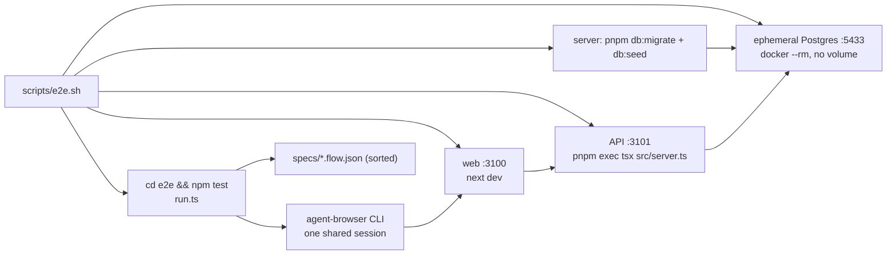

# e2e harness — how it works

`@devdigest/e2e` drives the real web app in a real browser with
[agent-browser](https://github.com/vercel-labs/agent-browser) (a CDP CLI). There is no
test framework, no Playwright and no LLM: a flow is a JSON list of CLI commands, and a
command's exit code is the assertion. The per-flow contract is in
[`../specs/flows.md`](../specs/flows.md).



## Pieces

| Path | Role |
|---|---|
| `scripts/e2e.sh` | Local hermetic stack: DB + migrate + seed + API + web, runs the flows, tears everything down. |
| `e2e/run.ts` | The runner: loads flows, executes each step via `agent-browser`, prints a summary, sets the exit code. |
| `e2e/lib/assert.ts` | `Flow` / `Step` types, `{BASE}` substitution, the substring check, `summarize()`. |
| `e2e/specs/NN-name.flow.json` | The flows. |
| `e2e/agent-browser.json` | CLI config: `headed: false`, `ignoreHttpsErrors: false`. |
| `server/src/db/seed.ts` | The fixture every assertion rests on. |
| `.github/workflows/e2e-web.yml` | CI: builds its own stack on the default ports and calls `npm test` directly. |

`scripts/e2e.sh` is a **local convenience only** — CI never runs it.

## The hermetic stack (`scripts/e2e.sh`)

Defaults dodge the dev stack (5432 / 3001 / 3000) and are all overridable:
`E2E_PG_PORT=5433`, `E2E_API_PORT=3101`, `E2E_WEB_PORT=3100`,
`E2E_PG_CONTAINER=devdigest-e2e-postgres`, `E2E_PG_IMAGE=pgvector/pgvector:pg16`.

Sequence:

1. Export `DATABASE_URL` (on `127.0.0.1`, not `localhost`, to avoid an IPv6 mismatch),
   `API_PORT`, `WEB_PORT`, `NEXT_PUBLIC_API_BASE`, `E2E_BASE_URL` **before** any child
   starts. dotenv does not override already-set variables, so these beat the server's
   own env file without editing it. `WEB_PORT` is exported because the API derives its
   CORS origin from it.
2. Install the `cleanup` trap (EXIT/INT/TERM) before starting anything. It kills the
   process **tree** leaves-first (`pnpm exec tsx` and `next dev` spawn the listener as a
   grandchild), reaps whatever still listens on the two alt ports, and removes the
   container.
3. `docker run --rm` a Postgres with a healthcheck and **no named volume** — empty on
   every run; waits up to 60 s for `healthy`.
4. Install deps only when `node_modules` is missing: `pnpm install` for `server` and
   `client`, `npm ci` for `reviewer-core` (the API imports its raw source at runtime and
   crashes with `ERR_MODULE_NOT_FOUND` without it).
5. Hard guard: refuse to continue unless `DATABASE_URL` contains `:<PG_PORT>/`. Then
   `pnpm db:migrate` and `pnpm db:seed`.
6. Start the API with `tsx` directly — not `pnpm start` (needs a build) and not
   `tsx watch` (a watcher restart mid-suite would flake). Poll `/health` for 60 s,
   failing fast if the process dies.
7. Start `next dev -p $WEB_PORT`, poll the root URL.
8. `cd e2e && npm test`; the script exits with the runner's exit code, through the trap.

## The runner (`e2e/run.ts`)

- Flows are every `specs/*.flow.json`, run in **lexical filename order**.
- Every step is `execFile(agent-browser, args, { cwd: e2e/, timeout })`. All steps of all
  flows share **one browser session**: the agent-browser daemon keeps the page between
  invocations, and `close` is issued once in a `finally` at the very end.
- A step fails when the command exits non-zero (or times out), or when an optional
  `assert.stdoutIncludes` substring is missing from stdout. The first failed step ends
  its flow; later flows still run.
- On a command failure a best-effort screenshot is written to
  `e2e/test-results/<flow-id>-fail.png`. A failed `stdoutIncludes` check does **not**
  take a screenshot.
- Exit code is `0` only when every flow passed; an empty `specs/` exits `1`.

Runner env: `E2E_BASE_URL` (default `http://localhost:3000`), `AGENT_BROWSER_BIN`
(default `agent-browser`), `E2E_STEP_TIMEOUT` ms (default `60000`).

## Flow JSON format

```jsonc
{
  "name": "shown in the log and summary",        // required
  "description": "why this flow exists",          // optional, ignored by the runner
  "steps": [
    { "cmd": ["open", "{BASE}/agents"], "label": "load the agents page" },
    { "cmd": ["wait", "--text", "Security Reviewer"] },
    { "cmd": ["get", "title"], "assert": { "stdoutIncludes": "DevDigest" } }
  ]
}
```

`cmd` is passed verbatim as argv; `{BASE}` is replaced in every argument with
`E2E_BASE_URL` minus trailing slashes. `label` defaults to the joined argv. The runner
does not validate or whitelist commands — the allowed set is a convention. No current
spec uses `assert`; the `get title` line above is illustrative only.

| Step | Form used in the specs | Meaning |
|---|---|---|
| navigate | `["open", "{BASE}/path"]` | load a URL |
| settle | `["wait", "--load", "networkidle"]` | wait for fetches to finish |
| assert URL | `["wait", "--url", "/pulls/482"]` | substring of the current URL |
| assert text | `["wait", "--text", "2 findings"]` | visible text appears |
| click by text | `["find", "text", "<text>", "click"]` | deterministic locator |
| click by role | `["find", "role", "button", "click", "--name", "Agent runs"]` | accessible name |

Allowed locators: `--url`, `--text`, `find role|text|label`. Never use agent-browser's AI
`chat` command, CSS selectors tied to generated class names, or `sleep`-style waits.

## Seeded data underpins every assertion

`server/src/db/seed.ts` is idempotent (select-then-insert, `onConflictDoNothing`) and
creates: repo `acme/payments-api`; PR **#482** "Add rate limiting to public API
endpoints" with four `pr_files` (including `src/config.ts`); one review with verdict
`request_changes`, score `61`, model `seed`; two findings — **CRITICAL** "Hardcoded
Stripe secret key in commit" and **WARNING** "N+1 query in user list endpoint"; and
three agents (General / Security / Performance Reviewer).

Two consequences:

- The root route redirects to the **first** repo. Only an empty-then-seeded DB guarantees
  that is `acme/payments-api`, which is why flows 02/04/05 fail against a dev DB with
  imported repos.
- With no GitHub token the pulls routes log a warning and serve the persisted rows
  (`server/src/modules/pulls/routes.ts`), so the seeded PR renders fully offline.

## Running a single flow

`run.ts` has no filter flag — `npm test` always runs every spec. To iterate on one flow,
keep a stack up and replay its steps by hand in the same shared session:

```sh
./scripts/dev.sh                      # or any seeded stack; note the web port
agent-browser open http://localhost:3000/agents
agent-browser wait --text "Security Reviewer"; echo "exit=$?"
agent-browser close
```

Do not rename or move spec files to skip flows; a full run is the real check.

## Debugging tips

- Look at `e2e/test-results/*-fail.png` first; it shows the page at the failed step.
- `agent-browser snapshot` (see `agent-browser --help`) prints the accessibility tree —
  use it to find the exact role and name before writing a `find role … --name` step.
- A `wait --text` timeout takes the full `E2E_STEP_TIMEOUT`; lower it while iterating.
- "API never became healthy" → usually missing `reviewer-core/node_modules` or a port in
  use: `lsof -nP -iTCP:3101 -sTCP:LISTEN`.
- Flows 02/04/05 land on the wrong repo → you are not on a freshly-seeded DB.
- Never "reset" the dev DB with `docker compose down -v`; it deletes the dev volume. The
  hermetic script never touches it.
- Type-check the runner with `cd e2e && npm run typecheck` (npm, not pnpm).
