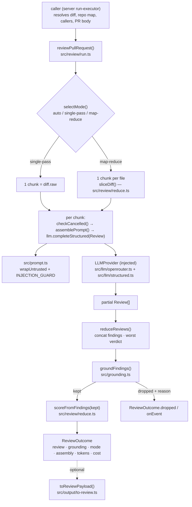

# Review pipeline — architecture and data flow

`@devdigest/reviewer-core` turns **(parsed diff + resolved agent inputs + an injected
LLM)** into a **grounded `Review`**. It does no I/O of its own: no DB, no GitHub, no
filesystem (`src/index.ts` header). The behavioural guarantees are restated as a contract
in [`../specs/review-contract.md`](../specs/review-contract.md).

## Data flow

## Entry points

| Export (`src/index.ts`) | File | Role |
|---|---|---|
| `reviewPullRequest` | `src/review/run.ts` | The engine entry point. The only function that calls the LLM. |
| `assemblePrompt`, `wrapUntrusted` | `src/prompt.ts` | Messages + `PromptAssembly` trace record. |
| `groundFindings`, `groundingSummary` | `src/grounding.ts` | Citation gate. |
| `reduceReviews`, `sliceDiff` | `src/review/reduce.ts` | Map-reduce helpers. |
| `toJsonSchema`, `extractJson`, `parseWithRepair` | `src/llm/structured.ts` | Structured-output helpers. |
| `OpenRouterProvider` | `src/llm/openrouter.ts` | The one bundled `LLMProvider`. |
| `toReviewPayload`, `gateTriggered`, `countBlockers` | `src/output/to-review.ts` | Review → GitHub review payload, deterministic CI gate. |

`scoreFromFindings` lives in `reduce.ts` but is **not** re-exported from `src/index.ts`.

## Strategy selection

`selectMode()` (`src/review/run.ts`) decides how many LLM calls are made:

- `single-pass` → always one call with `diff.raw`.
- `map-reduce` → one call per file, but only when the diff has more than one file.
- `auto` (default) → map-reduce only when total `additions + deletions` exceeds
  `mapThresholdLines` (`DEFAULT_MAP_THRESHOLD_LINES = 400`) **and** the diff is multi-file.
- The studio server pins `single-pass` unless the agent overrides it (`REVIEW_STRATEGY`
  in `server/src/modules/reviews/constants.ts`).

## Prompt assembly (`src/prompt.ts`)

Two messages are produced. The **system** message is the agent's system prompt plus
`INJECTION_GUARD`, appended on every path. The **user** message is built from sections
in this fixed order, each omitted when its input is empty:

1. `task` line (plain)
2. `## PR description` — untrusted, truncated to `MAX_PR_DESCRIPTION_CHARS = 4000`
3. `## Skills / rules` — resolved bodies, joined (not wrapped)
4. `## Relevant memory` — bullet list (not wrapped)
5. `## Repo skeleton` — the repo map, untrusted
6. `## Project context` — specs, each wrapped as `spec-<i>`
7. `## Callers of changed symbols` — untrusted
8. `## Diff to review` — always present, untrusted

`wrapUntrusted(label, content)` emits `<untrusted source="label">…</untrusted>` and
escapes any literal `</untrusted>` inside the content so a diff cannot close the fence.
Skills, memory and specs arrive as **resolved strings**; turning slugs into bodies is
the caller's job. The repo map is likewise built by the caller
(`buildRepoMapDigest` in `server/src/modules/reviews/run-executor.ts`) and passed as
`repoMap` only when non-empty.

In map-reduce mode each chunk gets its own prompt, but the `assembly` returned for the
trace is the whole-diff assembly; in single-pass it is the assembly of the one real call.

## LLM abstraction and structured output (`src/llm`)

The engine depends only on the `LLMProvider` interface from
`server/src/vendor/shared/adapters.ts` and calls exactly one method:
`completeStructured({ model, schema: Review, schemaName: 'Review', messages, maxRetries, sessionId? })`.

`OpenRouterProvider` (`src/llm/openrouter.ts`) drives any OpenAI-compatible endpoint
through the OpenAI SDK:

- `toJsonSchema()` converts the Zod `Review` schema via `zodResponseFormat` and sends it
  as `response_format: json_schema` with `strict: true`, `temperature` defaulting to `0`.
- `parseWithRepair()` tries `JSON.parse(raw)` first and only then falls back to
  `extractJson()` (fence / balanced-brace extraction). On a JSON or Zod failure it returns
  a `repromptMessage`; the provider appends the bad output plus that message and retries,
  up to `maxRetries + 1` attempts (`DEFAULT_REVIEW_MAX_RETRIES = 2`).
- HTTP 200 with no `choices` is turned into a thrown error (OpenRouter upstream failures).
- Cost prefers OpenRouter's real `usage.cost`; otherwise the injected `estimateCost`;
  otherwise `null`. `complete()` and `embed()` throw — they are intentionally stubs.

## Grounding gate (`src/grounding.ts`)

`buildLineIndex()` maps each diff file to its set of new-side line numbers
(`hunk.newLineNumbers`, falling back to `newStart … newStart+newLines`). A finding is
kept only if its file is in the diff and `[start_line, end_line]` intersects that set.
Kinds in `FULL_FILE_KINDS` (`secret_leak`, `lethal_trifecta`, `phantom`, `hook`) only
need the file to be present. Dropped findings carry a reason string and are emitted as
`info` events, so nothing disappears silently. The gate runs **once**, after the reduce
step, against the whole diff — not per chunk.

## Score reduction (`src/review/reduce.ts`)

`reduceReviews()` concatenates findings, takes the worst verdict and averages the
partial scores — but that averaged score never leaves the engine.
`reviewPullRequest` overwrites it with `scoreFromFindings(ground.kept)`:
`100 − Σ penalty`, clamped to `0…100`, with `CRITICAL 35 / WARNING 12 / SUGGESTION 3`.
The model's self-reported `score` is therefore only visible in the `Reduced to …`
progress event and in `ReviewOutcome.raw`.

## Errors and cancellation

- The engine has no `try/catch`. A provider error, a schema failure after all retries,
  or a throwing `checkCancelled` propagates to the caller; no partial `ReviewOutcome`
  is returned.
- `checkCancelled()` is called before **each** chunk's LLM call, so a map-reduce run can
  stop between files. The engine does not know the error type; the server throws its own
  `RunCancelledError` and maps it to status `cancelled`, anything else to `failed`
  (`server/src/modules/reviews/run-executor.ts`).
- `costUsd` becomes `null` for the whole run as soon as one chunk reports `null`.

## How the server consumes the package

- Path alias, source-level: `server/tsconfig.json` maps `@devdigest/reviewer-core` to
  `../reviewer-core/src/index.ts`; `server/vitest.config.ts` has the matching alias.
  Nothing is built — `npm run build` here is `tsc --noEmit`.
- The reverse alias also exists: `reviewer-core/tsconfig.json` and `vitest.config.ts`
  point `@devdigest/shared` at `server/src/vendor/shared`, so the contracts are
  single-sourced in the server.
- The package has its **own npm lockfile** (`reviewer-core/package-lock.json`). Install
  with `npm ci`, not pnpm. Because the API imports the raw source at runtime, a missing
  `reviewer-core/node_modules` crashes the API at boot with `ERR_MODULE_NOT_FOUND`
  (`scripts/e2e.sh`, `.github/workflows/e2e-web.yml`).
- Server touch points: `server/src/modules/reviews/run-executor.ts` (calls
  `reviewPullRequest`, `countBlockers`), `server/src/platform/container.ts`
  (`OpenRouterProvider`), and thin re-export shims in `server/src/platform/prompt.ts`,
  `grounding.ts`, `structured.ts` and `server/src/modules/reviews/helpers.ts`.

## Tests

`npm test` runs vitest over `test/**/*.test.ts`; CI is
`.github/workflows/reviewer-core.yml` (`npm ci` → `typecheck` → `test`). Hermetic: no keys, no network.

| File | Covers |
|---|---|
| `test/run.test.ts` | Full `reviewPullRequest` with the server's `MockLLMProvider` / `MockGitClient` (`server/src/adapters/mocks.ts`): grounding drop, score 65 and 100, cancel before the LLM call, `sessionId` forwarding. |
| `test/prompt.test.ts` | Injection guard, PR-description section order, omission and 4k truncation. |
| `test/to-review.test.ts` | Deterministic review event per `failOn`, `countBlockers`, inline-comment line anchoring. |
