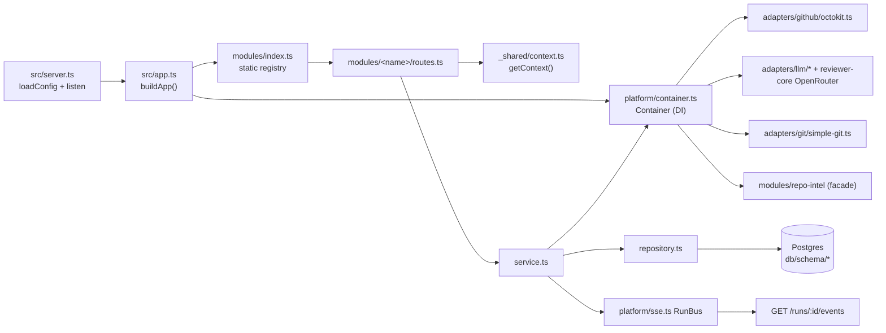

# Architecture — server (`@devdigest/api`)

Fastify 5 API over Postgres (Drizzle ORM, postgres-js). Zod schemas are both the
route validators and the wire contracts. All paths below are relative to `server/`.

## Data flow

## Bootstrap

- `src/server.ts` — `loadConfig()` → `buildApp({ config })` → `listen`; SIGTERM/SIGINT
  call `app.close()`, whose `onClose` hook ends the postgres pool.
- `src/app.ts` `buildApp(opts)` — exported so tests use `app.inject()` with no port.
  Order matters:
  1. create the db handle (unless `opts.db` is injected), build Fastify (1 MB body limit);
  2. set the zod validator/serializer compilers (`fastify-type-provider-zod`);
  3. `new Container(config, db, opts.overrides)` and `app.decorate('container', …)`;
  4. **await** `ReviewService.reapStaleRuns()` — every `agent_runs` row still
     `running` is orphaned by definition (single API instance per DB assumed);
  5. helmet, cors (single origin derived from config), SSE plugin, global rate
     limit (skipped when `nodeEnv === 'test'`);
  6. `/health` (liveness) and `/health/ready` (`select 1`, 503 on failure);
  7. `setErrorHandler` — registered **before** modules so encapsulated plugins inherit it;
  8. register every plugin from `src/modules/index.ts`.

## DI container and adapters

`src/platform/container.ts` is the composition root — one `Container` per app.
Services depend on the interfaces in `src/vendor/shared/adapters.ts`, never on
concrete classes. Tests pass `ContainerOverrides` (mocks live in `src/adapters/mocks.ts`).

| Member | Kind | Implementation |
| --- | --- | --- |
| `config`, `db`, `jobs`, `runBus`, `secrets`, `auth` | eager | `platform/jobs.ts` (p-queue mirrored into `jobs` table), `platform/sse.ts` (process-wide singleton bus), `adapters/secrets/local.ts`, `adapters/auth/local.ts` |
| `git`, `codeIndex`, `depgraph`, `tokenizer` | lazy getter | `adapters/git/simple-git.ts`, `adapters/codeindex/ripgrep.ts`, `adapters/depgraph/index.ts`, `adapters/tokenizer/index.ts` |
| `github()` | async, cached | `adapters/github/octokit.ts`; throws `ConfigError` when no GitHub token is stored |
| `llm(id)` | async, cached per id | `adapters/llm/openai.ts`, `adapters/llm/anthropic.ts`; `openrouter` comes from `@devdigest/reviewer-core` with `priceBook.estimate` injected |
| `embedder()` | async | `adapters/embedder/openai.ts`; throws before building a client when embeddings are disabled |
| `priceBook` | lazy | `platform/price-book.ts` — live OpenRouter prices, static `adapters/llm/pricing.ts` fallback |
| `agentsRepo`, `reviewRepo` | lazy | shared repositories so modules don't import each other's folders |
| `repoIntel` | lazy | `modules/repo-intel/service.ts` facade |

Secrets (provider keys, GitHub token) resolve **only** through `SecretsProvider` and
are absent from `AppConfig`; `invalidateSecretCaches()` drops cached clients after a key change.

## Module registration and anatomy

`src/modules/index.ts` is a static `Record<string, FastifyPluginAsync>`: `settings`,
`repos`, `pulls`, `polling`, `workspace`, `agents`, `reviews`, `repoIntel`. Static on
purpose (dynamic `import()` of `.ts` is not portable across tsx, bundler, vitest).
New feature = `modules/<name>/routes.ts` + one import + one entry.

A full module (`agents`, `repos`, `reviews`) is layered:

- `routes.ts` — default-exported plugin. Calls `appBase.withTypeProvider<ZodTypeProvider>()`,
  declares `schema.params/body`, resolves tenancy, delegates. No business logic.
- `service.ts` — business logic; takes the `Container` in its constructor.
- `repository.ts` — the only layer touching Drizzle. `reviews/repository.ts` is a
  facade over per-aggregate files in `reviews/repository/{review,run,pull}.repo.ts`;
  method value shapes are declared in both places and must match.
- `helpers.ts` / `constants.ts` — pure transforms (row → DTO) and literals.

Thin modules (`pulls`, `polling`, `settings`, `workspace`) keep queries inline in
`routes.ts`; `pulls/status.ts` holds the pure status-derivation helpers.

## `_shared` helpers

- `src/modules/_shared/context.ts` — `getContext(container, req)` → `{ workspaceId, userId }`
  via `AuthProvider`. With `LocalNoAuthProvider` it is always the default workspace
  and system user, but every route calls it so workspace scoping is never skipped.
- `src/modules/_shared/schemas.ts` — `IdParams` (`id` must be a uuid). A malformed
  id becomes a 422 at the edge instead of a Postgres cast error. Non-uuid ids
  (e.g. provider names in settings) define their own schema.

## Error handling

`src/platform/errors.ts` defines `AppError(code, message, statusCode = 400, details?)`
and subclasses: `NotFoundError` (404 `not_found`), `ValidationError` (422
`validation_error`), `ExternalServiceError` (502), `ConfigError` (500 `config_error`).
The handler in `src/app.ts` always answers with the `ApiErrorBody` envelope
`{ error: { code, message, details? } }`:

- request schema failure → 422 `validation_error`;
- response serialization failure → logged, generic 500 (the raw object is never leaked);
- `ZodError` thrown by a manual `.parse` → 422. Detected by `instanceof` **and** by
  shape, because two zod module instances can coexist;
- `AppError` → its own status/code; anything else → `internal_error`.

## Config

`src/platform/config.ts` parses `process.env` once through a zod `EnvSchema` into
`AppConfig`. Env keys: `DATABASE_URL`, `API_PORT`, `WEB_PORT`, `NODE_ENV`,
`LOG_LEVEL`, `DEVDIGEST_CLONE_DIR`, `EMBEDDINGS_ENABLED` (opt-in, must equal `true`),
`REPO_INTEL_ENABLED` (opt-out, anything but `false` is on). Derived fields:
`cloneDir`, `secretsPath` (both under the user's home), `webOrigin` (from `WEB_PORT`),
`logLevel` (silent under test).

## Database and migrations

- `src/db/client.ts` — `createDb(url)` returns `{ db, sql, close }`; one pool for
  the app, one per Testcontainers fixture.
- `src/db/schema.ts` — barrel plus the `schema` object used to type `drizzle()`. A
  new table must be added to **both** the `export *` list and that object.
- `src/db/schema/*` by domain: `core` (users, workspaces, members, settings),
  `repos`, `pulls` (`pull_requests` unique on repo_id+number, `pr_files`,
  `pr_commits`), `reviews` (`reviews`, `findings`, `pr_intent`, `pr_brief`), `runs`
  (`agent_runs`, `run_traces` — one jsonb doc per run, `multi_agent_runs`), `agents`,
  `skills`, `knowledge` (pgvector), `context`, `eval`, `ci`, `ops` (`jobs`, plugins,
  digests), `repo-intel`. `src/db/rows.ts` exports inferred row types for
  cross-module use.
- Tenancy: domain tables carry `workspace_id`; children (`findings`, `pr_files`) scope via the parent.
- Workflow: edit `src/db/schema/*.ts` → `pnpm db:generate` (drizzle-kit, configured
  in `drizzle.config.ts`) → commit the generated SQL + `meta/` snapshot →
  `pnpm db:migrate` (`src/db/migrate.ts`, which first ensures the `vector`
  extension). **`src/db/migrations/` is do-not-touch**: never hand-write or edit
  SQL or snapshots there. Seeds: `src/db/seed.ts`, `src/db/seed-prompts.ts`.

## Vendored contracts

`src/vendor/shared/` is imported as `@devdigest/shared` (alias in `tsconfig.json`
and `vitest.config.ts`). `contracts/*.ts` hold the Zod schemas (findings,
review-api, trace, platform, …); `adapters.ts` holds the adapter interfaces.
`client/src/vendor/shared/` is a hand-maintained mirror — no sync script; a wire
contract change lands in both copies together. Server-only adapter interfaces
(`adapters.ts`) have drifted ahead of the client copy, the HTTP contracts have not.
`@devdigest/reviewer-core` is likewise an alias to `../reviewer-core/src`.

## repo-intel in brief

`src/modules/repo-intel/` indexes a clone once (walk → ast-grep symbols → import
graph → PageRank file rank → cached repo map; see its `README.md`). Consumers
reach it **only** through `container.repoIntel.*` (`getRepoMap`, `getFileRank`,
`getCallerSignatures`, `getIndexState`, …). Degraded contract: array methods return
`[]`, object methods carry `degraded: true`; nothing throws for an unindexed repo
or when the feature flag is off. Routes: `GET /repos/:id/index-state`,
`POST /repos/:id/resync` (always 202; work runs on the `JobRunner`).

## Tests

- Unit (hermetic) — `test/*.test.ts` without `.it.`: `buildApp` with mock overrides
  (`test/routes-smoke.test.ts`), pure helpers (`test/pulls-status.test.ts`,
  `test/reviews-helpers.test.ts`, `test/grounding.test.ts`), contract fixtures
  (`test/contracts.test.ts`). Run: `pnpm exec vitest run --exclude '**/*.it.test.ts'`.
- Integration — `test/*.it.test.ts`: start `pgvector/pgvector:pg16` through
  `test/helpers/pg.ts` (Testcontainers + `runMigrations`). They skip cleanly when
  `dockerAvailable()` is false. Run: `pnpm exec vitest run .it.test`.
